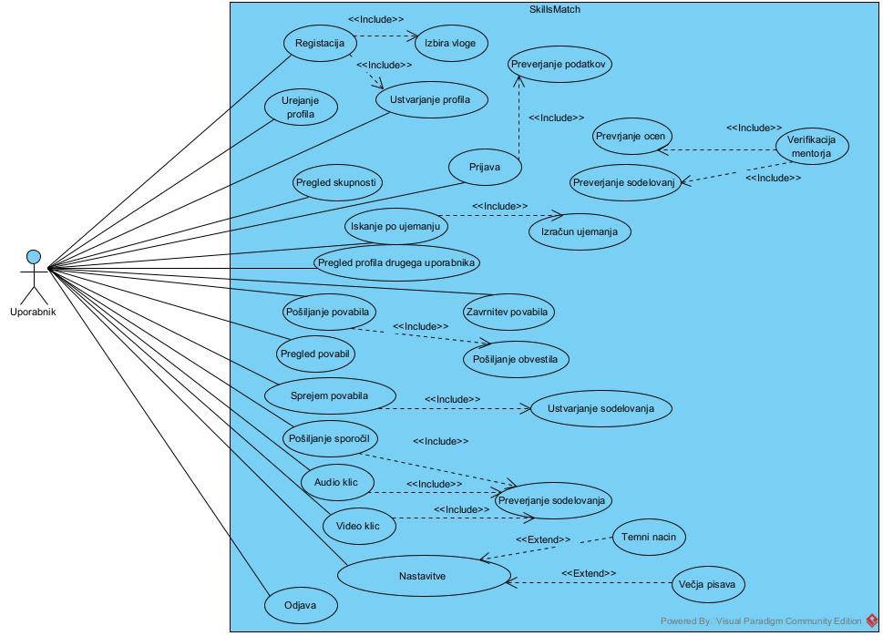
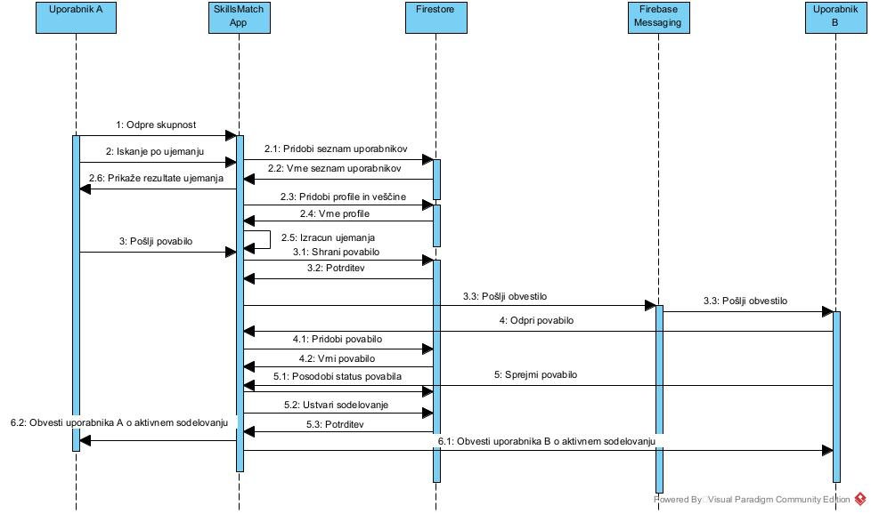
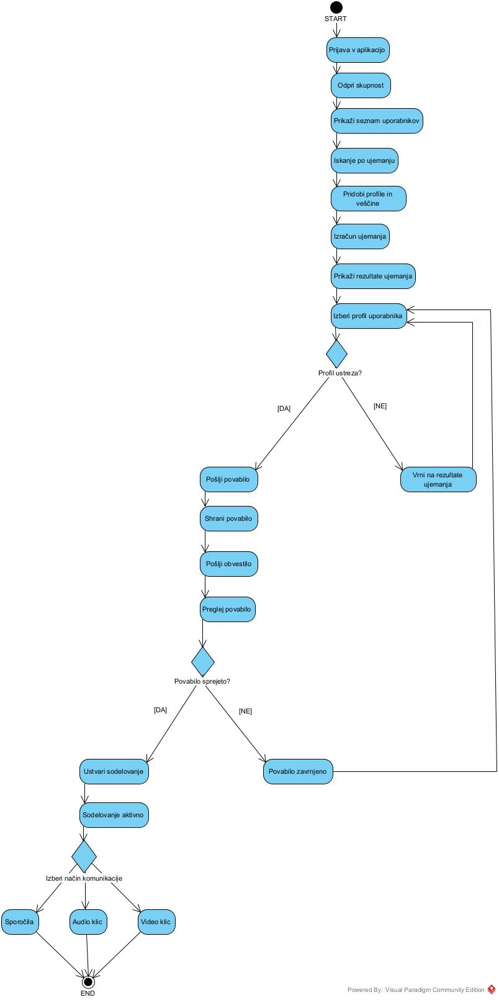
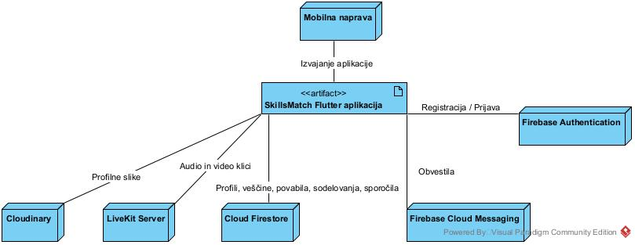
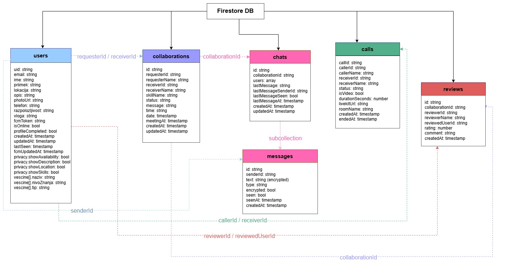
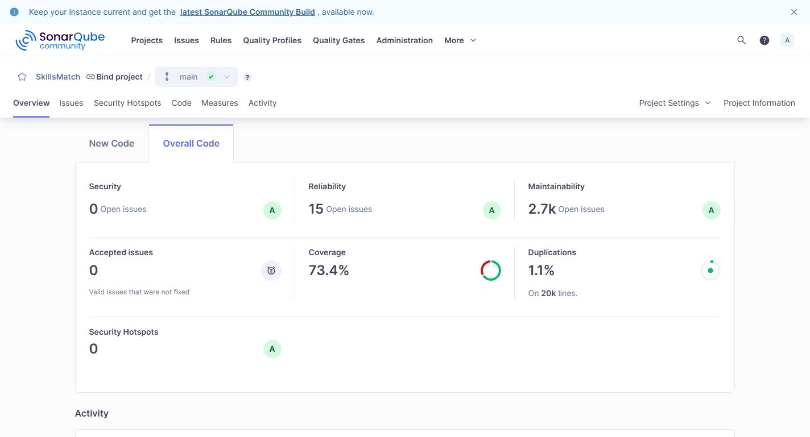
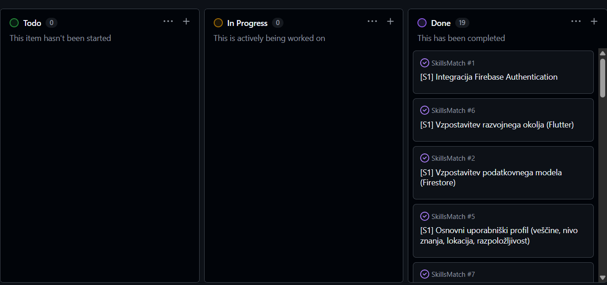

# 🎓 SkillsMatch

> Mobilna aplikacija za povezovanje mentorjev in učencev ter spodbujanje medgeneracijskega prenosa znanja.


***

## 📖 O projektu

SkillsMatch je mobilna aplikacija, razvita v okviru projektnega dela skupine **SkillBridge**, katere namen je povezovanje uporabnikov različnih generacij z namenom izmenjave znanja, izkušenj in veščin.

V sodobni družbi imajo starejše generacije bogate življenjske in strokovne izkušnje, medtem ko imajo mlajše generacije dostop do sodobnih tehnologij in velike količine informacij. Kljub temu pogosto prihaja do pomanjkanja neposrednega sodelovanja med generacijami.

Aplikacija SkillsMatch omogoča ustvarjanje skupnosti, kjer lahko uporabniki:

* delijo svoje znanje,

* poiščejo mentorja,

* poiščejo učenca,

* vzpostavijo sodelovanje,

* komunicirajo preko sporočil,

* izvajajo avdio in video klice,

* ocenjujejo sodelovanja,

* gradijo zaupanja vredno skupnost.

***

## ✨ Ključne funkcionalnosti

### 👤 Upravljanje uporabnikov

* Registracija uporabnikov

* Prijava uporabnikov

* Urejanje uporabniškega profila

* Nastavitve zasebnosti

* Nalaganje profilnih slik

### 🤝 Sistem ujemanja

* Iskanje uporabnikov glede na veščine

* Prikaz stopnje ujemanja

* Priporočanje ustreznih mentorjev in učencev

* Pregled skupnosti uporabnikov

### 📨 Povabila in sodelovanja

* Pošiljanje povabil

* Sprejem ali zavrnitev povabil

* Upravljanje sodelovanj

* Spremljanje aktivnih sodelovanj

### 💬 Komunikacija

* Besedilna sporočila

* Avdio klici

* Video klici

* Obvestila v realnem času

### ⭐ Sistem zaupanja

* Ocenjevanje uporabnikov

* Verifikacija mentorjev

* Pregled zgodovine sodelovanj

### ♿ Dostopnost

* Temni način

* Večja velikost pisave

* Enostaven uporabniški vmesnik

* Prilagojen prikaz za starejše uporabnike

***

# 🏗️ Arhitektura sistema

Sistem temelji na arhitekturi odjemalec–strežnik.

```text
Flutter App
     │
     ├── Firebase Authentication
     ├── Cloud Firestore
     ├── Firebase Cloud Messaging
     ├── Cloudinary
     └── LiveKit
```

### Arhitekturne odločitve

Pri razvoju aplikacije smo sprejeli več arhitekturnih odločitev, ki omogočajo dobro uporabniško izkušnjo, enostavno vzdrževanje sistema in razširljivost rešitve.

| Komponenta               | Razlog za izbiro                                                                          |
| ------------------------ | ----------------------------------------------------------------------------------------- |
| Flutter                  | Razvoj za Android in iOS iz ene same kode ter hitrejši razvoj uporabniškega vmesnika.     |
| Firebase Authentication  | Varna registracija in prijava uporabnikov brez razvoja lastnega sistema za avtentikacijo. |
| Cloud Firestore          | Shranjevanje podatkov v realnem času ter enostavna integracija s Flutter aplikacijo.      |
| Firebase Cloud Messaging | Pošiljanje obvestil o novih sporočilih, povabilih in klicih v realnem času.               |
| Cloudinary               | Shranjevanje in optimizacija profilnih slik ter zmanjšanje obremenitve podatkovne baze.   |
| LiveKit                  | Stabilna implementacija avdio in video klicev z nizko zakasnitvijo.                       |

### Uporabljene tehnologije

| Tehnologija              | Namen                       |
| ------------------------ | --------------------------- |
| Flutter                  | Razvoj mobilne aplikacije   |
| Dart                     | Programski jezik            |
| Firebase Authentication  | Registracija in prijava     |
| Cloud Firestore          | Shranjevanje podatkov       |
| Firebase Cloud Messaging | Push obvestila              |
| Cloudinary               | Profilne slike              |
| LiveKit                  | Avdio in video komunikacija |

***

# 📊 UML Diagrami

## Use Case Diagram



***

## Sequence Diagram



***

## Activity Diagram



***

## Deployment Diagram



***

## Podatkovna Shema



***

# 📂 Struktura projekta

```text
lib/
├── accessibility/
├── models/
├── screens/
├── services/
├── theme/
├── widgets/
├── firebase_options.dart
└── main.dart
```

### Glavni zasloni

* Login Screen

* Register Screen

* Profile Screen

* User Profile Screen

* Users List Screen

* Chat Screen

* Call Screen

* Incoming Call Screen

* Collaboration Screen

* Activity Analytics Screen

### Storitve

* Authentication Service

* Notification Service

* Call Notification Service

* Cloudinary Service

* Encryption Service

* Call Service

***

# 🚀 Namestitev

## Kloniranje repozitorija

```bash
git clone https://github.com/valentinaj24/SkillsMatch.git
```

## Namestitev odvisnosti

```bash
flutter pub get
```

## Zagon aplikacije

```bash
flutter run
```

***

# 🔐 Varnost

Aplikacija uporablja več mehanizmov za zagotavljanje varnosti:

* Firebase Authentication

* Firestore Security Rules

* HTTPS komunikacija

* Nadzor dostopa do podatkov

* Sistem ocen in verifikacij

* Upravljanje nastavitev zasebnosti

***

# 📱 Dostopnost

Pri razvoju smo posebno pozornost namenili dostopnosti, saj je aplikacija namenjena uporabnikom različnih starostnih skupin.

Implementirane funkcionalnosti:

* Temni način

* Večja velikost pisave

* Pregledna navigacija

* Veliki interaktivni elementi

* Enostaven uporabniški vmesnik

***

# 🧪 Zagotavljanje kakovosti

Projekt SkillsMatch vključuje večplastni pristop k zagotavljanju kakovosti, ki združuje avtomatizirano enotirano testiranje, integracijske teste celotnega toka aplikacije ter statično analizo kode.

***

## Strategija testiranja

| Vrsta testiranja                 | Orodje                     | Datoteka                              | Obseg                                   |
| -------------------------------- | -------------------------- | ------------------------------------- | --------------------------------------- |
| Enotno testiranje (unit tests)   | `flutter_test` + `mockito` | `test/skills_match_test.dart`         | Validatorji, poslovna logika            |
| Integracijski testi (end-to-end) | `integration_test`         | `integration_test/app_flow_test.dart` | Celoten tok aplikacije                  |
| Statična analiza kode            | SonarQube                  | `sonarqube/README.md`                 | Kakovost in vzdrževalnost kode          |
| CI/CD avtomatizacija             | GitHub Actions             | `.github/workflows/flutter_tests.yml` | Zaganjanje testov ob vsakem `push`/`PR` |

***

## 🔬 Enotni testi (`skills_match_test.dart`)

Enotni testi preverjajo izolirano poslovno logiko aplikacije, neodvisno od Firebase ali uporabniškega vmesnika. Uporabljena je knjižnica **Mockito** za nadomeščanje zunanjih odvisnosti (Firebase Auth, Firestore) z lažnimi objekti (mock), kar zagotavlja deterministične in hitre teste.

### Testirane komponente

**Prijava (`LoginValidator`)**

Testira validacijo vnosnih polj in mapiranje Firebase napak na sporočila v slovenščini. Pokriva robne primere: prazna polja, polja samo z belo preslednico, neznane kode napak.

```
Login - validacija polja         (5 testov)
Login - mapiranje Firebase napak (5 testov)
Login - uspješan scenarij        (3 testi)
```

**Registracija (`RegisterValidator`)**

Preverja pravilen format e-poštnega naslova z regularnim izrazom, minimalno dolžino gesla, ujemanje obeh vnosov gesla ter odziv ob že zasedeni e-pošti.

```
Register - validacija polja      (5 testov)
Register - uspješan scenarij     (3 testi)
```

**Povabila za sodelovanje (`InvitationValidator`)**

Validira vse pogoje pred pošiljanjem povabila: prijavljen uporabnik, veljaven ID prejemnika, prepoved pošiljanja sebi, izbrana veščina, in da je izbrani termin v prihodnosti.

```
Pozivnica - uspješan scenarij    (1 test)
Pozivnica - neuspješni scenariji (5 testov)
Pozivnica - skillNames ekstrakcija (3 testi)
Pozivnica - receiverName         (2 testa)
```

**Sporočila v chatu (`MessageValidator`)**

Preverja, da se prazna ali zgolj presledkovna sporočila ne pošljejo, da je uporabnik prijavljen, in da se prepreči dvojno pošiljanje med obstoječo zahtevo.

```
Chat - validacija poruke         (5 testov)
Chat - uspješan scenarij         (3 testi)
```

**Zakaj takšen pristop?**
Validacijska logika je bila izvlečena iz zaslonov v ločene razrede (`LoginValidator`, `RegisterValidator`, `InvitationValidator`, `MessageValidator`), kar omogoča testiranje brez inicializacije celotne Flutter aplikacije. Uporaba `ServiceLocator` vzorca za injiciranje odvisnosti omogoča zamenjavo pravih Firebase instanc z mock objekti v testnem okolju.

***

## 🔄 Integracijski testi (`app_flow_test.dart`)

Integracijski test preverja celoten tok aplikacije od začetka do konca, v realnem emulatorju, z dejansko Firebase instanco (testno okolje).

### Tok testa

```
1. Registracija novega uporabnika (direktno prek Firebase SDK)
2. Zagon aplikacije → zaznava onboarding zaslona
3. Prijava z ustvarjenimi podatki
4. Dopolnitev profila (ime, opis, lokacija, veščina, razpoložljivost)
5. Pošiljanje povabila za sodelovanje drugemu uporabniku
6. Prijava kot drugi uporabnik → sprejem povabila
7. Odpiranje chata → pošiljanje in prikaz sporočila
```

**Zakaj integracijski test?**
Enotni testi zagotavljajo pravilnost posameznih komponent, integracijski test pa potrdi, da vse komponente skupaj delujejo kot celota — da navigacija med zasloni, Firebase operacije in UI elementi pravilno sodelujejo v realnem scenariju uporabe.

Uporablja se knjižnica `integration_test`, ki je Fluttrov uradni okvir za end-to-end testiranje. Test teče v pravem emulatorju in komunicira z dejansko bazo Firestore, kar zagotavlja visoko stopnjo zaupanja v delovanje aplikacije.

***

## ⚙️ CI/CD (`flutter_tests.yml`)

Testi se samodejno izvajajo ob vsakem `push` ali `pull_request` na vejah `main` in `dev` prek **GitHub Actions**.

```yaml
Sprožilci: push / pull_request → main, dev
Okolje:    ubuntu-latest
Koraki:
  1. Checkout kode
  2. Namestitev Flutter 3.x
  3. flutter pub get
  4. Generiranje mock objektov (build_runner)
  5. flutter test test/skills_match_test.dart
```

To zagotavlja, da nobena sprememba kode ne prestavi napake v glavno vejo brez uspešno opravljenih testov.

***

## 📊 Statična analiza kode – SonarQube

Za merjenje kakovosti in vzdrževalnosti kode je bila opravljena statična analiza z orodjem **SonarQube**.

> 📸 **Posnetek prve analize:** 

SonarQube je analiziral kodo po naslednjih dimenzijah:

| Dimenzija             | Opis                                                 |
| --------------------- | ---------------------------------------------------- |
| **Security Hotspots** | Potencialno občutljive točke v kodi                  |
| **Reliability**       | Napake (bugs), ki lahko povzročijo napačno delovanje |
| **Maintainability**   | Code Smells – otežujejo vzdrževanje kode             |
| **Coverage**          | 66,7 % kode pokrite s testi                          |
| **Duplications**      | 1,1 % podvojene kode (od 20k vrstic)                 |

Rezultati prve analize so služili kot izhodišče za prepoznavanje področij za izboljšave. Na podlagi teh ugotovitev so bile najbolj kritične težave odpravljene pred zaključkom projekta.

***

### ✅ Rezultati po odpravi kritičnih težav

Po opravljenih popravkih (dodani manjkajoči testi, odpravljene najresnejši code smells) smo analizo ponovili.

> 📸 **Posnetek končne analize:**\
> 

| Dimenzija             | Opis                                          | Rezultat                       |
| --------------------- | --------------------------------------------- | ------------------------------ |
| **Security**          | Varnostne ranljivosti                         | 0 odprtih težav, ocena **A**   |
| **Reliability**       | Napake, ki lahko povzročijo napačno delovanje | 0 odprtih težav, ocena **A**   |
| **Maintainability**   | Code Smells                                   | ocena **A** (manjša opozorila) |
| **Coverage**          | Delež kode, pokrit z testi                    | **73,4 %**                     |
| **Duplications**      | Podvojena koda                                | **1,1 %** (nespremenjeno)      |
| **Security Hotspots** | Potencialno občutljive točke                  | **0**                          |

Vse ključne pomanjkljivosti so bile odpravljene. Končna koda dosega **oceno A** na vseh področjih kakovosti.

***

# 🔮 Nadaljnji razvoj

V prihodnosti načrtujemo:

* naprednejši sistem priporočanja uporabnikov,

* skupinska mentorstva,

* integracijo koledarja,

* spremljanje napredka pri učenju,

* sistem značk in dosežkov,

* večjezično podporo.

***

# 📋 Projektno vodenje

Pri razvoju projekta smo uporabljali GitHub Projects in Kanban metodologijo za organizacijo dela, spremljanje napredka.

Naloge so bile razdeljene v kategorije:

* Todo

* In Progress

* Done

Takšen pristop nam je omogočil pregled nad razvojem projekta, spremljanje napredka posameznih funkcionalnosti ter učinkovito sodelovanje med člani ekipe.

## Kanban tabla



# 👨‍💻 Projektna skupina

Projekt je bil razvit v okviru skupine **SkillBridge**.

### Člani ekipe

* Teodora Krunić

* Valentina Jovanović

* Mateja Djurić

***

# 📄 Licenca

Projekt je razvit izključno za izobraževalne in študijske namene.
